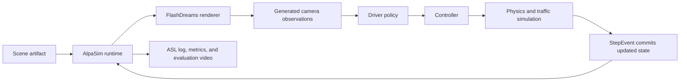

<!--
SPDX-FileCopyrightText: Copyright (c) 2026 NVIDIA CORPORATION & AFFILIATES. All rights reserved.
SPDX-License-Identifier: Apache-2.0

Licensed under the Apache License, Version 2.0 (the "License");
you may not use this file except in compliance with the License.
You may obtain a copy of the License at

http://www.apache.org/licenses/LICENSE-2.0

Unless required by applicable law or agreed to in writing, software
distributed under the License is distributed on an "AS IS" BASIS,
WITHOUT WARRANTIES OR CONDITIONS OF ANY KIND, either express or implied.
See the License for the specific language governing permissions and
limitations under the License.
-->

# Checkpoint-free ClipGT scenes in an AlpaSim closed loop

This guide converts recorded ClipGT Parquet tables into the scene artifact used
by FlashDreams and AlpaSim, then runs OmniDreams as AlpaSim's stateful video
renderer. This path does **not** train a NuRec reconstruction and does not
require a NuRec checkpoint.

Two OmniDreams commands implement the workflow:

- `omnidreams-build-alpasim-usdz` validates one ClipGT cache and builds a scene
  artifact.
- `omnidreams-run-alpasim-closed-loop` builds the source-mounted renderer
  environment and asks the AlpaSim wizard to run the closed loop.

> [!IMPORTANT]
> The generated `.usdz` is a ZIP-based FlashDreams/AlpaSim application bundle.
> It is not a general-purpose Pixar USD stage and is not expected to open in a
> generic USDZ viewer. "Checkpoint-free" here means that no per-scene NuRec
> checkpoint is needed; the OmniDreams world model and the selected AlpaSim
> policy still load their pretrained model checkpoints.

This recorded-data converter differs from
[`scene_fixture.py`](../omnidreams/interactive_drive/scene_fixture.py), which
builds self-contained synthetic scenes for tests and demos. `clipgt_usdz.py`
validates and packages an existing recorded ClipGT cache.

## Prerequisites

Run the commands in this document from the FlashDreams workspace root. You
need:

- a FlashDreams checkout containing the OmniDreams integration;
- a compatible AlpaSim checkout;
- `uv`, Docker with BuildKit, the NVIDIA container runtime, and suitable NVIDIA
  GPUs;
- access to the OmniDreams and policy checkpoints used by the selected
  pipeline and driver; and
- one JPEG seed frame or an MP4 whose first frame comes from the calibrated
  front-wide camera.

Install the workspace dependencies without starting a model:

```bash
uv sync --package flashdreams-omnidreams
```

Set `HF_TOKEN` before the first model run when the required Hugging Face assets
are gated:

```bash
export HF_TOKEN=<YOUR-HF-TOKEN>
```

The launcher defaults to GPU 6 for FlashDreams and GPU 7 for the AlpaSim
driver, physics, and traffic simulation services. Override these indices on
machines with a different GPU layout.

## 1. Prepare one ClipGT directory

The converter accepts either unprefixed filenames:

```text
<clipgt-dir>/
├── calibration_estimate.parquet
├── egomotion_estimate.parquet
├── lane.parquet
├── road_boundary.parquet
├── traffic_sign.parquet
├── wait_line.parquet
├── obstacle.parquet              # optional
└── ...                           # other ClipGT tables are optional
```

or filenames prefixed with the source clip ID:

```text
<clipgt-dir>/<clip-id>.egomotion_estimate.parquet
```

Only the final component before `.parquet` is used as the canonical table
name. Therefore, prefixed and unprefixed copies of the same table must not
coexist in one input directory.

The following files must be present:

- `calibration_estimate.parquet`: at least one row;
- `egomotion_estimate.parquet`: at least two rows with strictly increasing
  timestamps after sorting;
- `lane.parquet`: at least one row;
- `road_boundary.parquet`;
- `traffic_sign.parquet`; and
- `wait_line.parquet`.

The last three tables may be empty, but AlpaSim's current MADS vector-map
importer opens them unconditionally. Every non-empty table must use the same
non-empty `key.clip_id` in every row.

## 2. Build the scene artifact

Use a source video when its first frame is the desired visual seed:

```bash
uv run --package flashdreams-omnidreams \
  omnidreams-build-alpasim-usdz \
  --clipgt-dir /data/clipgt/sample \
  --initial-video /data/rgb/sample.mp4 \
  --output /data/scenes/sample.usdz
```

Or provide a JPEG directly:

```bash
uv run --package flashdreams-omnidreams \
  omnidreams-build-alpasim-usdz \
  --clipgt-dir /data/clipgt/sample \
  --initial-frame /data/rgb/sample-first-frame.jpg \
  --output /data/scenes/sample.usdz
```

Exactly one of `--initial-video` and `--initial-frame` is required. The frame
aspect ratio must match the camera calibration. The checkpoint-free converter
currently supports only `camera:front:wide:120fov`, which becomes the logical
camera ID `camera_front_wide_120fov` in the artifact. For an MP4 input, the
converter decodes only its first frame; it does not copy the source video into
the artifact.

Useful optional arguments are:

```text
--prompt TEXT              Text conditioning stored in prompt.txt
--training-date YYYY-MM-DD Informational metadata; defaults to 1970-01-01
```

`1970-01-01` is a stable sentinel, not a model-training claim. The bundle has
an empty `training_step_outputs` mapping because this workflow has no trained
scene checkpoint.

Inspect the result before running it:

```bash
unzip -l /data/scenes/sample.usdz
unzip -p /data/scenes/sample.usdz metadata.yaml
```

Use `metadata.yaml`'s `scene_id` when explicitly selecting a scene. The scene
ID is a deterministic UUID5 derived from the source ClipGT ID and camera; it is
not necessarily the `.usdz` filename.

## 3. Inspect the closed-loop command

The print-only mode validates paths and prints the Docker and AlpaSim commands
without building an image or starting services:

```bash
uv run --package flashdreams-omnidreams \
  omnidreams-run-alpasim-closed-loop \
  --scene-dir /data/scenes \
  --output-dir /data/runs/sample \
  --alpasim-repo /path/to/alpasim \
  --limit 1 \
  --n-sim-steps 80 \
  --print-only
```

Use `--dry-run` instead of `--print-only` to let the AlpaSim wizard generate
and validate the deployment without running the rollout. Unless `--skip-build`
is also passed, dry-run mode still builds the renderer dependency image.

## 4. Run the closed loop

On the first run, build both the FlashDreams base image and the source-mounted
dependency image:

```bash
uv run --package flashdreams-omnidreams \
  omnidreams-run-alpasim-closed-loop \
  --scene-dir /data/scenes \
  --output-dir /data/runs/sample \
  --alpasim-repo /path/to/alpasim \
  --limit 1 \
  --n-sim-steps 80 \
  --flashdreams-gpu 6 \
  --alpasim-gpu 7 \
  --build-base
```

For later runs, reuse the dependency image:

```bash
uv run --package flashdreams-omnidreams \
  omnidreams-run-alpasim-closed-loop \
  --scene-dir /data/scenes \
  --output-dir /data/runs/sample-2 \
  --alpasim-repo /path/to/alpasim \
  --limit 1 \
  --n-sim-steps 80 \
  --skip-build
```

Pass `--scene-id <metadata-scene-id>` more than once to select an explicit
set. Without it, AlpaSim discovers local artifacts under `--scene-dir`.
`--allow-existing-output` permits reuse of a non-empty output directory, but a
new directory is safer for comparing runs.

The launcher's relevant defaults are:

| Setting | Default |
|---|---|
| AlpaSim deployment | `deploy=managed_flashdreams` |
| topology | `1gpu` |
| driver | `vavam_video_model` |
| video-model timing | `+chunking=8frame` |
| simulation steps | `80` |
| evaluation video | enabled, every simulation state |
| renderer GPU | `6` |
| driver/physics/traffic GPU | `7` |

The script is an orchestration layer. Driver inference, control, physics,
traffic simulation, event scheduling, and metric evaluation remain AlpaSim
services; OmniDreams supplies the stateful renderer.

## Why this is a feedback closed loop



The driver's trajectory prediction is not copied directly into the next
render request. AlpaSim sends it through the controller and physics services.
At the end of the control cycle, `StepEvent` commits the corrected ego
trajectory and accumulated traffic trajectories to rollout state. The video
model's next chunk is conditioned on that committed state. Consequently, new
camera observations affect the policy, and the controller/physics result
affects the following observations.

## Outputs and video cadence

AlpaSim writes each rollout under a hierarchy similar to:

```text
<output-dir>/
├── rollouts/<scene-id>/<rollout-id>/
│   ├── *.asl
│   ├── metrics.parquet
│   ├── *.mp4
│   └── _complete
├── aggregate/
├── wizard-config.yaml
└── run_metadata.yaml
```

The evaluation MP4 combines the camera view, map, and metrics. It contains one
rendered frame per retained simulation state, so its frame rate can be much
lower than the video model's 30 Hz camera stream. This is expected and does not
mean that OmniDreams generated only those frames.

To export the timestamped camera stream embedded in an ASL log, run the
AlpaSim utility from the AlpaSim checkout:

```bash
cd /path/to/alpasim
uv run --package alpasim_utils \
  python -m alpasim_utils.asl_to_frames \
  '<output-dir>/rollouts/**/*.asl' \
  --format mp4
```

For video-model rollouts, the utility exports streams such as
`video_model_rgb_camera_front_wide_120fov.mp4`. It derives the output FPS from
the ASL timestamps instead of the number of simulation steps. It sorts the
recorded images by timestamp and does not interpolate or duplicate missing
frames. Use `--log-save-dir <directory>` to collect exports under one root.

For the validation rollout, the two MP4 products were:

| Product | Frames | FPS | Duration | Meaning |
|---|---:|---:|---:|---|
| AlpaSim evaluation summary | 82 | approximately 3.75 | 21.87 s | One composed frame per retained simulation state. |
| ASL `video_model_rgb` stream | 645 | 30 | 21.50 s | Every generated camera image recorded in the ASL. |

The ASL contained 645 camera images; the exporter did not pad this to the 651
egomotion rows in the source ClipGT.

## Docker context, layers, and source mounts

`docker/Dockerfile.alpasim.dockerignore` limits the dependency build context to
the workspace metadata and selected source packages. In particular, it
excludes `integrations/alpadreams/` and its retained local data. The development
image installs third-party dependencies with `--no-install-workspace`; at
runtime the launcher mounts only these workspace source trees read-only, plus
the explicitly configured Hugging Face, Torch, and FlashDreams cache paths:

```text
flashdreams/                         -> /workspace/flashdreams/flashdreams
integrations/omnidreams/             -> /workspace/flashdreams/integrations/omnidreams
```

This keeps an unrelated retained data tree out of context transfer, BuildKit
source snapshots, image layers, and runtime mounts. It does not remove any
large data already stored in old Docker images or caches.

## ClipGT Parquet format

ClipGT is a collection of typed Parquet tables rather than one monolithic
file. Each filename identifies a label class or scene-data kind. Rows share a
three-column envelope:

| Column | Logical type | Meaning |
|---|---|---|
| `key` | struct | Identity and, depending on the table, time or map keys. |
| `<table-name>` | struct | The table-specific payload; for example, the payload column in `lane.parquet` is `lane`. |
| `version` | integer | Schema/data version. The validation sample uses `uint64` for most tables and `int64` for calibration. |

The converter checks this envelope for every discovered Parquet. It copies the
source Parquets byte-for-byte into the artifact after validation.

### Key variants

The current sample uses three key shapes:

| Kind | Key fields | Used by |
|---|---|---|
| Timed singleton/trajectory | `clip_id`, `timestamp_micros`, `label_class_id` | calibration and egomotion |
| Timed object observation | the timed fields plus `label_id` | obstacles |
| Static map element | `clip_id`, `label_class_id`, `map_id`, `map_id_version` | lanes, boundaries, signs, markings, and other map tables |

- `clip_id` joins all tables belonging to one recorded interval.
- `timestamp_micros` is an integer timestamp in microseconds.
- `label_id` identifies one labeled observation; `trackline_id` in the obstacle
  payload joins observations into a time series.
- `map_id` identifies one vector-map element and `map_id_version` identifies
  its revision.
- `label_class_id` describes the label namespace/class associated with the
  record.

The sample's reusable nested Arrow types can be summarized as:

```text
Vec3     = struct<x: float32, y: float32, z: float32>
Quat     = struct<x: float32, y: float32, z: float32, w: float32>
Polyline = list<Vec3>
```

### Geometry and pose conventions

- Positions, dimensions, and polylines use nested `{x, y, z}` values in metres.
- Orientations use quaternion fields in `x, y, z, w` order.
- The map, ego poses, and obstacle poses must already share a consistent scene
  coordinate frame. The converter does not perform geographic reprojection or
  a global coordinate transform.
- Camera-to-rig calibration uses FLU axes: x forward, y left, and z up.
- `nominalSensor2Rig_FLU` stores roll/pitch/yaw in degrees and translation in
  metres. Optional correction fields are composed by the runtime.

### Logical row examples

The following is the logical structure returned by Arrow for one egomotion
row. It is shown as JSON for readability; the physical file remains Parquet.
Values are placeholders rather than recorded sample values.

```json
{
  "key": {
    "clip_id": "<clip-id>",
    "timestamp_micros": 1000000,
    "label_class_id": "<ego-label-class>"
  },
  "egomotion_estimate": {
    "name": "ego",
    "location": {"x": 0.0, "y": 0.0, "z": 0.0},
    "orientation": {"x": 0.0, "y": 0.0, "z": 0.0, "w": 1.0}
  },
  "version": 1
}
```

One static lane row has this shape:

```json
{
  "key": {
    "clip_id": "<clip-id>",
    "label_class_id": "<lane-label-class>",
    "map_id": "<map-element-id>",
    "map_id_version": "<map-version>"
  },
  "lane": {
    "left_rail": [{"x": 0.0, "y": 1.8, "z": 0.0}],
    "right_rail": [{"x": 0.0, "y": -1.8, "z": 0.0}],
    "left_edge_styles": ["<style>"],
    "right_edge_styles": ["<style>"],
    "egomotion_label_class_id": "<ego-label-class>"
  },
  "version": 1
}
```

### Calibration payload

`calibration_estimate.rig_json` is a JSON string. The selected camera has a
structure equivalent to:

```json
{
  "rig": {
    "sensors": [
      {
        "name": "camera:front:wide:120fov",
        "properties": {
          "Model": "ftheta",
          "width": "<pixels>",
          "height": "<pixels>",
          "cx": "<principal-point-x>",
          "cy": "<principal-point-y>",
          "polynomial": "<coefficients>",
          "polynomial-type": "<type>"
        },
        "nominalSensor2Rig_FLU": {
          "roll-pitch-yaw": [0.0, 0.0, 0.0],
          "t": [0.0, 0.0, 0.0]
        },
        "correction_sensor_R_FLU": {
          "roll-pitch-yaw": [0.0, 0.0, 0.0]
        },
        "correction_rig_T": [0.0, 0.0, 0.0]
      }
    ]
  },
  "version": 1
}
```

The current path requires an FTheta camera model with `width`, `height`, `cx`,
`cy`, `polynomial`, `polynomial-type`, and `nominalSensor2Rig_FLU` present.
Numeric calibration properties may be serialized as strings in source data.

### Tables in the validation sample

The sanitized, locally validated sample contains 12 source tables, 2,305 rows,
and about 167.5 KiB of Parquet data. Its 651 egomotion poses span about 21.67
seconds; adjacent timestamps are 33,333 or 33,334 microseconds apart,
approximately 30 Hz. File size is encoding-dependent and is included only to
characterize this sample.

| File | Rows | Size | Main payload fields | How the converter uses it |
|---|---:|---:|---|---|
| `calibration_estimate.parquet` | 1 | 6.0 KiB | `name`, `rig_json` | Selects and validates the front-wide camera. |
| `egomotion_estimate.parquet` | 651 | 31.9 KiB | `name`, `location`, `orientation` | Builds timestamped rig poses, camera timestamps, and the ground mesh. |
| `obstacle.parquet` | 1,389 | 51.4 KiB | `trackline_id`, `center`, `size`, `orientation`, `category`, `egomotion_label_class_id` | Groups dynamic observations into traffic tracks. Tracks with fewer than two distinct timestamps are omitted. |
| `lane.parquet` | 91 | 27.5 KiB | `left_rail`, `right_rail`, edge styles, `egomotion_label_class_id` | Supplies road-lane geometry and ground coverage. |
| `road_boundary.parquet` | 42 | 10.9 KiB | `category`, `location`, driving directions, endpoint physical flags, `egomotion_label_class_id` | Supplies required vector-map boundaries and ground coverage. |
| `lane_line.parquet` | 29 | 7.8 KiB | `line_rail`, `styles`, `colors`, driving directions, `egomotion_label_class_id` | Supplies lane-marking geometry. |
| `pole.parquet` | 29 | 4.9 KiB | `category`, `location`, `is_implicit`, `intersection_subtype`, `egomotion_label_class_id` | Preserves pole geometry and extends ground coverage. |
| `traffic_sign.parquet` | 23 | 6.8 KiB | `center`, `dimensions`, `orientation`, `category`, `egomotion_label_class_id` | Supplies required sign geometry and ground coverage. |
| `wait_line.parquet` | 20 | 4.8 KiB | `category`, `location`, `is_implicit`, `intersection_subtype`, `egomotion_label_class_id` | Supplies required stop/wait-line geometry and ground coverage. |
| `road_marking.parquet` | 18 | 5.4 KiB | `category`, `location`, `is_implicit`, `intersection_subtype`, `egomotion_label_class_id` | Preserves road-marking geometry and extends ground coverage. |
| `traffic_light.parquet` | 11 | 5.9 KiB | `center`, `dimensions`, `orientation`, `category`, `egomotion_label_class_id` | Preserves traffic-light geometry and extends ground coverage. |
| `crosswalk.parquet` | 1 | 4.1 KiB | `category`, `location`, `is_implicit`, `intersection_subtype`, `egomotion_label_class_id` | Preserves crosswalk geometry and extends ground coverage. |

The converter retained 16 obstacle tracks from the 1,389 observations in this
sample. Retention depends on `trackline_id` grouping and the two-timestamp
minimum, so it cannot be inferred from the obstacle row count alone.

## Generated artifact layout

For the validation sample, the converter wrote a 22-member, approximately
4.0 MiB archive with this layout:

```text
sample.usdz
├── metadata.yaml
├── rig_trajectories.json
├── sequence_tracks.json
├── mesh_ground.ply
├── prompt.txt
├── first_image.png
├── frames/camera_front_wide_120fov/<first-timestamp>.jpeg
└── clipgt/
    ├── camera_front_wide_120fov.json
    ├── calibration_estimate.parquet
    ├── egomotion_estimate.parquet
    ├── lane.parquet
    ├── ... copied source tables ...
    ├── association.parquet
    └── clip.parquet
```

| Member | Purpose |
|---|---|
| `metadata.yaml` | Scene identity, source clip ID, dataset hash, sensor list, and time range. |
| `rig_trajectories.json` | Timestamped ego/rig transforms, camera frame ranges, and the vehicle bounding box used by AlpaSim. |
| `sequence_tracks.json` | Timestamped obstacle poses, dimensions, categories, and controllable flags. |
| `mesh_ground.ply` | Coarse ego-oriented ground ribbon covering known map and obstacle geometry for checkpoint-free physics compatibility. |
| `prompt.txt` | OmniDreams text conditioning. |
| `first_image.png` and `frames/...jpeg` | The same initial visual anchor in compatibility locations. Only one recorded image is embedded. |
| `clipgt/<camera>.json` | One camera timestamp record derived from every egomotion pose. |
| `clipgt/*.parquet` | Canonically named, byte-identical source ClipGT tables. |
| `clipgt/clip.parquet` | Generated clip metadata when the source cache does not provide it. |
| `clipgt/association.parquet` | Generated empty `NEXT_LANE` relationships when the source cache does not provide lane associations. |

The sample's `rig_trajectories.json` contains 651 rig poses and 651 camera
timestamp ranges. The full 651-frame source MP4 is intentionally **not**
embedded: OmniDreams needs the first image as a visual anchor, then generates
new frames from closed-loop trajectories and scene conditioning. The converter
derives these camera timestamps from egomotion; it does not read or compare an
independent camera timestamp table.

The generated coarse ground ribbon has 1,306 vertices and 1,304 triangles for
this sample. These triangles provide broad physics/map coverage; they are not
a reconstructed visual surface.

## Validation and publication notes

- All source Parquets are copied byte-for-byte. Inspect calibration metadata,
  identifiers, and dataset licensing before publishing a generated artifact.
  Sanitizing a derived copy before conversion is preferable to editing a
  generated ZIP.
- The local validation sample described above is not committed by this guide.
  Its aggregate schema statistics are documented without recording IDs,
  coordinates, or camera pixels.
- A successfully created ZIP proves local structural validation; it does not
  prove that every future AlpaSim importer accepts arbitrary ClipGT variants.
- The first model run may spend several minutes downloading checkpoints,
  compiling kernels, building CUDA graphs, and autotuning. Do not treat warm-up
  latency as steady-state simulation performance.

Implementation references:

- [`clipgt_usdz.py`](../omnidreams/interactive_drive/clipgt_usdz.py)
- [`alpasim_closed_loop.py`](../omnidreams/interactive_drive/alpasim_closed_loop.py)
- [`Dockerfile.alpasim`](../../../docker/Dockerfile.alpasim)
